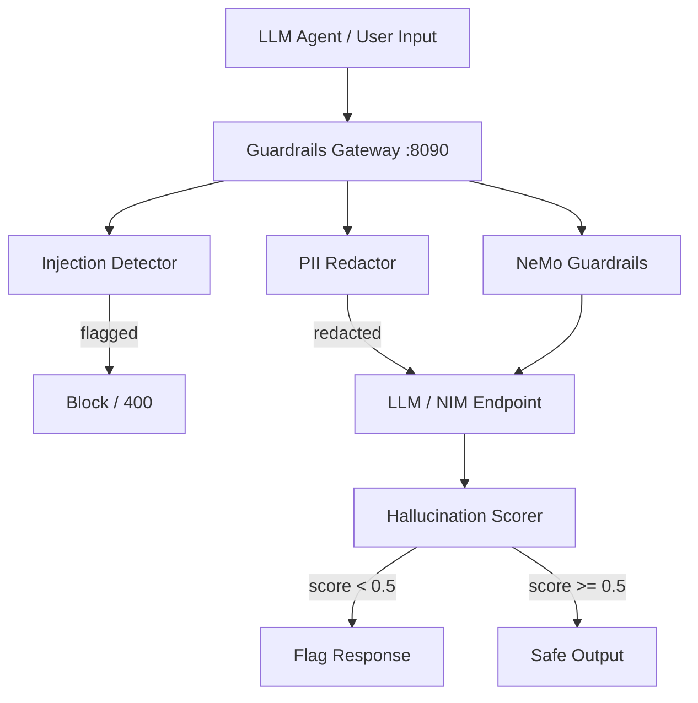

# Architecture — agentic-guardrails-eval

## Overview
Multi-layer guardrails pipeline that screens both inputs and outputs of agentic LLM systems.

## Layers
| Layer | Tool | Action |
|---|---|---|
| Prompt injection | Heuristics + LLM | Block request |
| PII | Presidio | Redact before LLM |
| Hallucination | LLM faithfulness scorer | Flag/warn output |
| Dialog rails | NeMo Guardrails | Topical + safety rails |
| Eval | LangSmith | Continuous regression testing |
